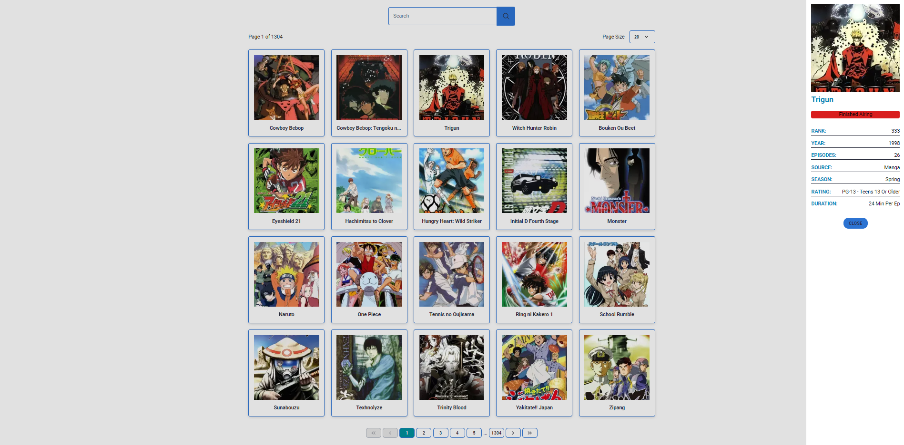

## Anime App
Anime application with fetching data from api, search, pagination using NextJS

### Deployment

- https://anime-project-nextjs.vercel.app/


### Install instructions:

```bash
1. git clone https://github.com/alexpashchuk/react-tasks.git
2. cd react-tasks
3. git checkout 05-next
4. npm i
5. npm next dev
```

### Used technologies

- Next
- TypeScript
- Redux, Redux Toolkit
- Vitest

### Screenshot


